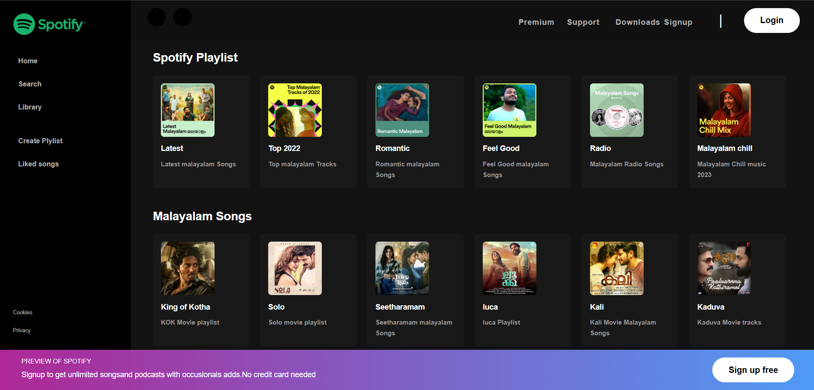

# 🎧 Spotify Clone (HTML & CSS Only)

A static clone of Spotify's homepage built using **only HTML and CSS**. This project is designed for front-end beginners to practice layout design and styling without JavaScript.

## 🚀 Live Demo

👉 [Live App](https://spotify-clone-html-css-eta.vercel.app/)

## 🛠️ Tech Stack

- **HTML5**
- **CSS3**

## ✨ Features

- Spotify-inspired modern UI
- Flexbox-based layout
- Custom icons and button styles
- Visual similarity with the original design

## 📚 Ideal For

- Practicing HTML & CSS structure
- Front-End Layout Practice
- UI Cloning Exercises
- Beginners in web development

## 📫 Contact Me

- **📧 Email:** muhdzaheermv@gmail.com  
- **🔗 Portfolio:** [https://portfolio-lilac-eight-60.vercel.app/](https://portfolio-lilac-eight-60.vercel.app/)  
- **💼 LinkedIn:** [https://www.linkedin.com/in/muhammed-zaheer-836132244/](https://www.linkedin.com/in/muhammed-zaheer-836132244/)

## ⭐ Like This Project?

If you liked this clone or learned something new, don’t forget to **⭐ star** the repo — your support means a lot!

